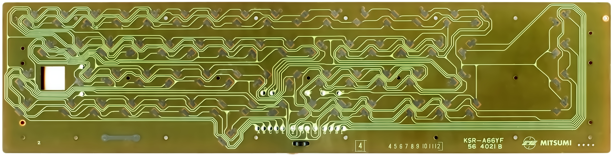

# Keyboard PCBs

This repository contains digital reproductions of several vintage mechanical keyboard PCBs. Ideally, each keyboard PCB would have:

1. A reference scan
2. A vector drawing (Inkscape SVG)
3. A KiCad project

However, there are no KiCad projects for these boards yet. 

# Index

### Commodore 64

### Maxi-Switch 630107-02

### Northstar Advantage

Incomplete.

### Osborne 1

Incomplete.

### See Also

These keyboards have their own repo.

* [Micro Switch SD-16273 (Space Cadet)](https://github.com/rljacobson/SpaceCadet) 
* [The Tardis Keyboard Computer](https://github.com/rljacobson/smurd)

# License

These works are provided under the permissive variant of the CERN Open Hardware License (CERN-OHL-P) or the Creative Commons license  <a href="http://creativecommons.org/publicdomain/zero/1.0?ref=chooser-v1" target="_blank" rel="license noopener noreferrer" style="display:inline-block;">CC0 1.0 Universal</a>, whichever you prefer, whenever such a license is legally applicable.

